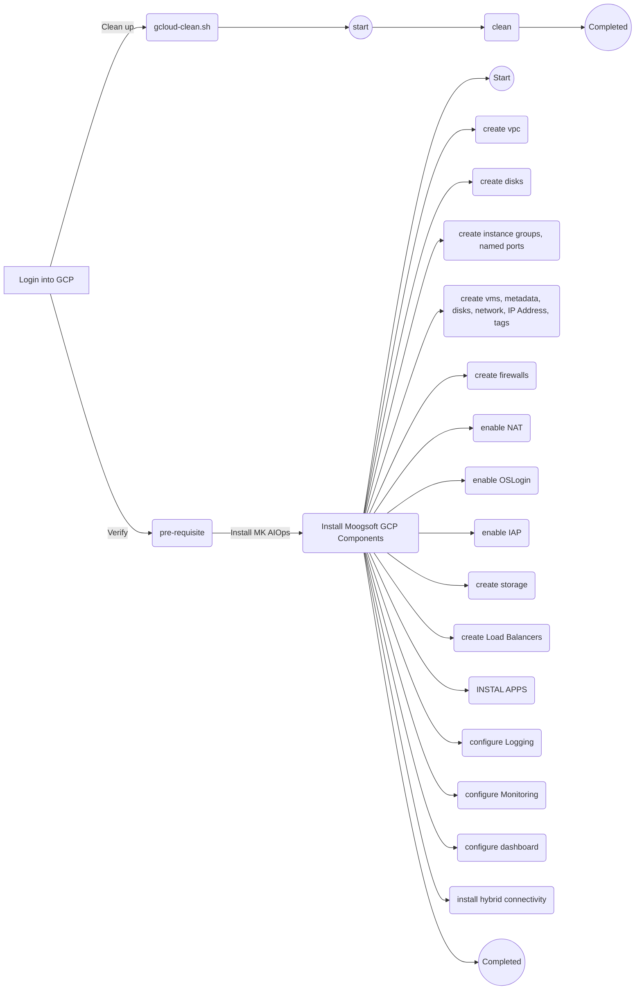

# AIOps on GCP

Hcl-GCP AIOps upgrading thier Moogosft on prem set up into  Moogost 8.0.x on GCP Platform.  In this documents covers pre-requisites, all the feature components, Installation, FAQs and Clean up Scripts.

# Pre-requisite

- **API Enablement:**  Appropriate list of APIs needs to be enabled.
- **Initiator/user** should have **roles/owner** to start create GCP Components
- **ssl certificate** - Keep it ready before configure Load Balancer
- **ServiceAccountUser/Admin** - create **dedicated service account** for all vms to do cloud-storage access, simple compute engine related commands rather default service account users.
   command : 

## Info
| S.No | Task Item |  Remarks |
|--|--|--|
| 1 | Hcl-GCP Active directory should be Integrated with Google Cloud IAM   | Already Exist
| 2 | API Enablement  | gcloud command available
| 3 | Service account | infra-mk-admin is the service account assigned with all VMs|
| 4 | Create MK-GCP Users and assign appropriate Roles/Permissions | MK-GCP Users ( Begin,Mahesh,Shanmuga ), MK-APPs Users ( Farook ) |
| 5 | SSL Certificate should be generated if not exists| Already exists|

# Roles Required
| S.No | User Name |  Roles  |
|--|--|--|
| 1 | Begin Samuel| Owner role - initial 2 days required |
| 2 | Shanmuga, Mahesh/GCP User |Roles Required for 2 days:<li>Compute Instance Admin(v1)</li><li>Compute OS Admin Login(v1)</li><li>Deployment Manager Editor</li><li>Editor</li><li>Service Account User</li><li>IAP-secured Web App User<li>IAP-secured Tunnel User</li><li>Service Account Admin</li><li>Storage Object Admin</li><li>Network Admin</li> <li>Compute Engine Service Agent</li><li>Logging Admin</li><li>Monitoring Admin</li><li>Browser</li> Revoke **Editor and Compute Instance Admin** roles after 2 days.  Revoke **Logging Admin, Monitoring Admin, Network Admin and Service Account Admin** roles after 3 days |
| 3 | Farook/App User | <li>Browser</li> <li>Compute Instance Admin(v1)</li><li>Compute OS Admin Login(v1)</li><li>Deployment Manager Editor</li><li>Service Account User</li><li>IAP-secured Web App User<li>IAP-secured Tunnel User</li><li>Storage Object Admin</li><li>Network User</li> <li>Compute Engine Service Agent</li> |
| 4 | dedicated service account for all Vms | <li>Browser</li> <li>Deployment Manager Editor</li><li>Service Account User</li><li>IAP-secured Web App User<li>IAP-secured Tunnel User</li><li>Storage Object Admin</li><li>Network User</li> <li>Compute Engine Service Agent</li> |

# Roles Definition
| S.No | Roles |  Purpose  |
|--|--|--|
| 1 | Browser | Users can browse all GCP Resources under Moogsoft project |
| 2 | Deployment Manager Editor | Used to deploy scripts using deployment manager |
| 3 | Service Account User | gcloud command can be executed by dedicated Service Account|
| 4 | IAP-secured Tunnel User | Users can click **ssh** in GCP Console to Login|
| 5 | Storage Object Admin |Users can upload/download files to existing buckets | 
| 6 | Network Admin | Users can manage Load Balancers |
| 7 | Compute Engine Service Agent | Service Account can access Compute Engine APIs from Vms |
| 8 | Compute OS Admin Login | MK users can login into VMs in root mode |
| 9 | Compute Instance Admin(v1) | Create,delete,edit VMs, disks|
| 10 | Logging Admin | Users can manage Logging|
| 11 | Monitoring Admin | Users can manage Monitoring|

# How to Install 
In this section covers complete installation  of Hcl-GCP AIOps components.

## command
> cd mk-service
> ./gcloud-install-vpc-bastion-host.sh
> ./gcloud-install-mk-components.sh 

# Components/Features

In this section elaborate the feature components of GCP used on this project engagement.
| S.No | Resources |  Enabled  |   Status |
|--|--|--|--|
| 1 | Get Access | Yes | done
| 2 | API Enablement | Yes | done
| 3 | Create Service Account | Yes | done
| 4 | Virtual Private Network | Yes | done
| 5 | Compute Engine | Yes | done
| 6 | Persistent Disks | Yes | done
| 7 | Attach/Detach Disks | Yes | done
| 8 | Firewall  | Yes | done
| 9 | NAT | Yes | done
| 10 | IAP/OS Login | Yes | done
| 11 | Cloud Storage | Yes | done
| 12 | Bastion/Jumbo Host | Yes | done ( may not required)
| 13 | External Load Balancer | done | 
| 14 | Operation Suite | InProgress | 
| 15 | Dashboard  | In Progress | 
| 16 | Application Installation   | In Progress | 
| 17 | Test - Connectivity, Availability   | Yet to be done | 
| 16 | Hybrid Connectivity with Data Center | Yet to be done | 

# API-Enablement

- gcloud services enable  secretmanager.googleapis.com
- gcloud services enable  websecurityscanner.googleapis.com
- gcloud services enable  vpcaccess.googleapis.com 
- gcloud services enable cloudresourcemanager.googleapis.com

# FAQ

How to Create new VMs.

gcloud  compute --project=PROJECT_ID instances create corevm-1 \
--zone=europe-west1-b \
--machine-type=n1-highmem-2 \
--subnet=mk-networks \
--network-tier=PREMIUM \
--maintenance-policy=MIGRATE \
--service-account=SERVICEACCOUNT_NAME \
--scopes=https://www.googleapis.com/auth/cloud-platform \
--tags=mk-core,mk-corevm1,mk-corevms,mk-vm,mk-vms \
--disk=name=corevm-1-boot,device-name=corevm-1-boot,mode=rw,boot=yes \
--disk=name=corevm-1-disk,device-name=corevm-1-disk,mode=rw,boot=no \
--no-shielded-secure-boot \
--shielded-vtpm \
--shielded-integrity-monitoring \
--reservation-affinity=any

How to create new Disks
gcloud  compute disks create PROJECT_NAME --project=PROJECT_ID \
 --type=pd-standard --size=20GB --zone=europe-west1-b --image=centos-7-v20200910  \
 --image-project=centos-cloud --physical-block-size=4096
 
 How to do gcloud SSH
 
 gcloud compute ssh --project PROJECT_ID --zone ZONE VM_NAME
 
 How to list all VMs
 gcloud compute instances list
 
 How to list out Config – gcloud config 

## Clean up

This section covers the command for both **dev** and **test** environment to reset or clean up the existing deployments/resources in order to **install, test, clear and re-deploy** the gcp resources in the same environment based on demand rather spinning up another environment every time.

## command
> cd mk-service 
./gcloud-cleanup.sh 

## Todo
- Operation Suite Logging for actual Application Once installed
- Operation Suite Monitoring for actual Process, Port, URI, etc
- Hybrid connectivity with Datacenter

## GCP Development Activities

| S.No | Activities |  Environment | Owner | Remarks |
|--|--|--|--|--|
| 1 | Grant MK GCP Access   | Dev | Hcl-GCP | |
| 2 | Verify MK GCP Access  | Dev | HCL  | |
| 3 | Create Service Account | Dev | Hcl-GCP | |
| 4 | Create VPC  | Dev | HCL-team  | |
| 5 | Create Bastion-Host | Dev | HCL-GCP  | |
| 6 | Create MK Components/Features | Dev | HCL-GCP  | |
| 7 | Keep separate config for Dev Environment| Dev | HCL-App  | |
| 8 | Prepare Hand-outs  | Dev | HCL-App  | |
| 9 | Notify HCL-App team once Infra enabled. | Dev | HCL-App  |  we are in #14. However it is not a blocker for below activities|
| 10 | Start Moogsoft Installation | Dev | HCL-App  | |
| 11 | Do Connectivity, Availability, Failover testing | Dev | HCL-App/HCL-GCP/MK  | |
